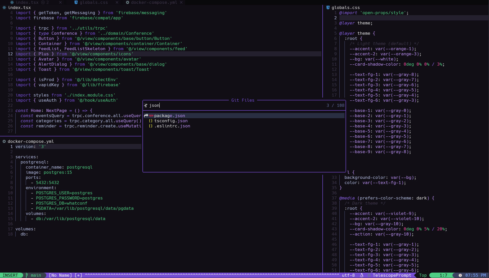
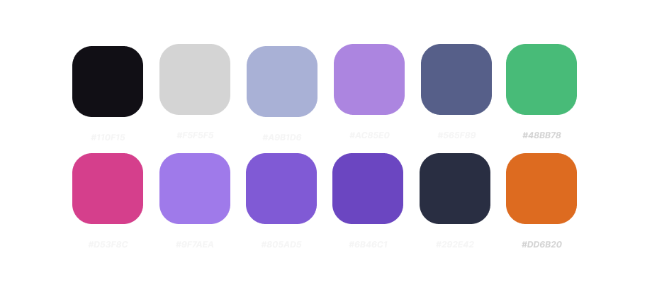

# 🟣 amethyst

Stunning purplish colorscheme for neovim/lunarvim!


---




### Color palette



## Features

Supports:

- NvimTree
- Telescope
- GitSigns
- LSP diagnostics
- Lualine

## Installation

Using [Packer](https://github.com/wbthomason/packer.nvim)

```lua
use "jeferson-sb/amethyst"

```

or

```lua
return {
 "jeferson-sb/amethyst"
}
```
